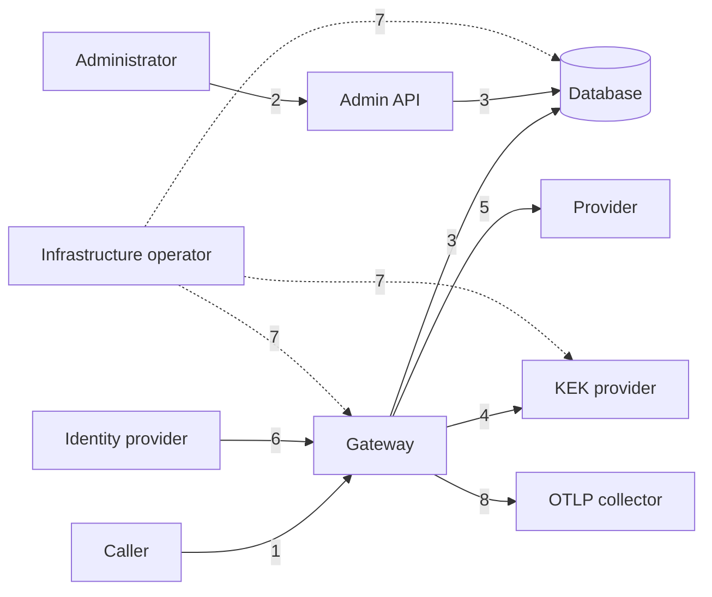
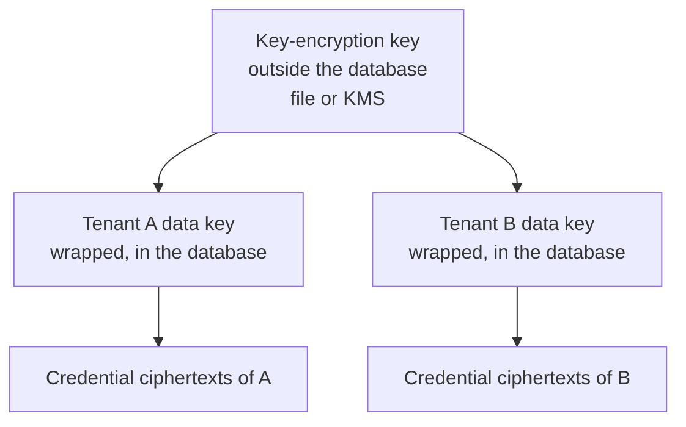

# Security model

- Status: initial threat model, 2026-11-11. It is reviewed at every release and independently
  before 1.0 (SEC-05, SEC-09).
- Decisions: [ADR 0005](../adr/0005-data-plane-authentication.md),
  [ADR 0008](../adr/0008-vault-envelope-encryption.md),
  [ADR 0018](../adr/0018-supply-chain.md),
  [ADR 0056](../adr/0056-users-memberships-and-sessions-as-principals.md) to
  [ADR 0059](../adr/0059-idempotency-keys.md)

## What is protected

| Asset | Why it matters |
|---|---|
| Provider credentials of tenants | They are spendable money and access to the tenant's provider account. They cannot be recreated by the platform |
| Tenant separation | One tenant must not see or affect another's configuration, usage or spend |
| Usage ledger and audit log | They are the evidence for what was spent and for investigations |
| A tenant's usage records, limit events and price lists | They describe what a tenant consumes and what it pays. Through the product only the tenant reads them: row-level security on their tables, tenant-scoped permissions that no platform role holds, no platform operation or definer function that returns them, and a request log and traces that hold no tenant data: no tenant or caller identifier, model, usage, cost or limit rule ([ADR 0054](../adr/0054-usage-data-is-the-tenants.md), [ADR 0055](../adr/0055-operational-telemetry-holds-no-tenant-data.md)). The platform sees operational indicators of the installation, with no tenant and no cost |
| Content in transit | Prompts and completions pass through memory and must leave no trace |
| Availability and spend | A caller must not exhaust the service or a budget that is not theirs |

## Trust boundaries

```mermaid
flowchart LR
    caller[Caller] -- 1 --> gw[Gateway]
    admin_user[Administrator] -- 2 --> adm[Admin API]
    gw -- 3 --> db[(Database)]
    adm -- 3 --> db
    gw -- 4 --> kek[KEK provider]
    gw -- 5 --> provider[Provider]
    gw -- 8 --> otel[OTLP collector]
    idp[Identity provider] -- 6 --> gw
    infra[Infrastructure operator] -. 7 .-> gw
    infra -. 7 .-> db
    infra -. 7 .-> kek
```

1. **Caller to gateway.** Untrusted. Everything the caller sends is input: path, headers, body,
   metadata, trace context. Only a verified credential establishes identity and tenant.
2. **Administrator to admin API.** People hold a session, obtained through the identity
   provider or a local account: a server-side session in a cookie that scripts cannot read, read from
   the database at every request, accepted on this listener only ([sign-in guide](../operations/sign-in.md),
   [ADR 0056](../adr/0056-users-memberships-and-sessions-as-principals.md),
   [ADR 0057](../adr/0057-local-accounts-and-sessions-formats-and-numbers.md)). Automation uses
   administrator keys; tokens of trusted issuers are accepted here too when the operator sets
   `tokens.admin_listener`, as service accounts only. A request carries one credential, chosen in a fixed
   order (a public sign-in operation reads none; an `Authorization` header is a key or a token and a cookie
   beside it is ignored; otherwise the cookie). A state-changing request with a session needs a custom
   header and an `Origin` equal to the expected origin, and a listener known to be in clear text outside
   loopback refuses to sign anyone in until the operator names the HTTPS origin in front of it
   (`auth.public_origin`). Every operation is authorized. A client that runs in the user's browser is
   untrusted: what it hides is not a control. The admin port is not meant for the public internet.
3. **Process to database.** Each role connects with its own least-privileged database role. The
   database enforces tenant isolation independently of the application.
4. **Process to KEK provider.** Whoever holds the key-encryption key and the database can decrypt
   every credential. The two are stored and backed up apart.
5. **Gateway to provider.** Outbound only, to hosts in the catalogue, with certificate
   verification.
6. **Identity provider.** Trusted to assert identities, and, for platform-level issuers, tenants.
   A compromised identity provider can impersonate what it is trusted to assert, which is why
   issuers are scoped (IAM-07). A tenant-bound issuer is trusted for one tenant only. A platform-level
   issuer is trusted for the tenants of its explicit list, by the claim value listed for each, and for
   nothing else; only a platform administrator edits the list, and every edit is audited. A token is
   verified offline with keys that the gateway fetches from an address an administrator registered:
   `https` only, through the egress guard, public addresses unless the operator lists the host in
   `tokens.private_hosts`, with size, time and rate limits, and nothing of the answer returned or
   logged. The two things a registration cannot protect are named here. First, a shared issuer is
   separated between tenants by the audience alone: the pair (issuer, audience) is unique in the
   installation, so a tenant cannot register a pair another tenant uses, but if the workloads of
   tenant A present an audience that A has not registered or no longer registers, another tenant can
   register that pair and its mapping would then receive those calls (the residual case of the
   [tokens guide](../operations/tokens.md), section 5; the guide requires an audience naming the
   installation and the tenant). Second, a token cannot be revoked before it expires.

   **The identity provider for people** is a second use of this boundary. The operator configures one
   provider (`auth.oidc.*`); Pandokos is its confidential client with PKCE, state and nonce, and trusts it
   to assert who a person is and, through explicit group rules in the configuration, which role the person
   holds. A compromised provider can sign in as any person it knows, and the rules give each group no more
   than the operator wrote: `platform-admin` and `tenant-admin` only, in tenants that exist. The
   administration role fetches the provider's documents through the egress guard, of the one configured
   issuer only; the ID token is validated, its subject read and every provider token dropped at once
   ([ADR 0058](../adr/0058-openid-connect-relying-party.md)).
7. **Infrastructure operator.** See the next section.
8. **Gateway to trace collector.** Outbound only, to the one URL the operator configured, through
   the same guard as provider calls (certificates verified, no proxy, no redirect, forbidden
   addresses refused). It receives spans that carry only the attributes the OpenTelemetry conventions make Required, never a tenant identifier or content,
   a header value or caller metadata ([telemetry guide](../operations/telemetry.md),
   [ADR 0040](../adr/0040-traces.md)); what each destination receives is listed in
   [data flows](../reference/data-flows.md).

**The capability check** (`getCapability`, [ADR 0043](../adr/0043-tenant-capability-check-and-usage-list.md))
runs in the administration plane and reads only catalogue state and credential metadata
(`provider_credential_metadata`); it never opens a credential, holds no vault or key material and
audits nothing.

**The two functions that cross the tenant boundary** (sprint 5.3, [database guide](../operations/database.md),
section 16) are the only places where a database role acts across tenants for limit rules, and neither
reads a rule across tenants. `delete_platform_issuer_limit_rules`, executable by the admin role, is what the
platform session needs to delete a platform-level issuer: it refuses a session outside the platform scope,
works tenant by tenant as that tenant's session, can delete nothing but rules of mappings of the issuer
it is given, and writes the audit row of each in the tenant's log. `record_unlimited_traffic`, executable
by the gateway role, which has no privilege on either audit log, writes one fixed kind of row
(`limit.unlimited_traffic`) for the tenant of its session, with every argument checked. A tenant's
session may also update its own tenant row (policy `tenant_self_update`), and a trigger leaves it the time
zone and nothing else. Limit rules reference their subject, provider and model with foreign keys that
ignore row-level security, so the deletion of a provider or a model is refused for a rule of any tenant
without the deleting session seeing it, and without a function that reads rules across tenants.

**The Compose reference** ([guide](../operations/compose.md)) makes these trust choices: both listeners
use TLS from a self-signed certificate that `setup.sh` generates; ports are published on the host's
loopback only; PostgreSQL is on a network with no route out and is not published, and the server
verifies its certificate (`verify-full`); the Pandokos containers are read-only, drop all capabilities
and cannot gain privileges; secrets are files, never environment values. The secret files are
readable by every user of the host that can enter the `secrets` directory (the directory is mode 0700,
the files 0444, because the containers run as other users), so the vault reports the key-file
permission warning, which is expected there. The reference is for a first trial, not for production.

## What Pandokos does not protect against

A person or process that controls the host, the container runtime, the database, the backups and
the key-encryption key can read tenant credentials: by decrypting them, or by reading the memory
of a running gateway. The rule that platform administrators cannot read tenant secrets is an
application and database control. It removes the capability from the product's interfaces and
makes misuse visible; it is not cryptographic separation from the organization that runs the
installation.

**Confidentiality of a tenant's data against whoever administers the database, the hosts or the backups is
out of scope (issue #33).** The owner role, a superuser, a backup or a host reads every table, the
usage records, limit events and price lists of a tenant among them. Row-level security separates
tenants from each other and from the platform roles of the product, not from the operator of the
installation. This sprint narrows what the product itself exposes; it does not encrypt usage data.

A tenant that needs separation from the operator's infrastructure needs its own cell, with its
own key-encryption key held where it decides.

Pandokos reduces this exposure by keeping plaintext in memory for a bounded time, by not storing
the key-encryption key with the data, by supporting an external KMS so the key never reaches a
disk the operator's database administrators can read, and by auditing every administrative act.

## Threats and controls

| Threat | Controls |
|---|---|
| A caller claims another tenant | The tenant derives only from the credential (TEN-02). Tenant headers and parameters are ignored |
| A bug omits a tenant filter | Forced row-level security under non-owner roles (TEN-04, TEN-05). The isolation suite (TEN-07) |
| A stolen virtual key | Keys are scoped, can expire, carry limits, are revocable within a bound, and have a detectable format so scanners find leaks (IAM-03 to 05) |
| A stolen bearer token | The token is accepted only if it verifies against the registration's keys with an allowed asymmetric algorithm, its exact issuer and audience, a lifetime of at most `tokens.max_lifetime` (24 h by default) and a mapped subject; `exp` is required and the signature is checked on every request. It can be replayed until `exp`, and one token cannot be revoked: delete the mapping. Mutual TLS for stronger binding (IAM-15, IAM-16) |
| A tenant registers the issuer another tenant uses | The pair (issuer, audience) is unique in the installation; a token selects its registration by that pair, so another tenant's registration with another audience never receives it. The tenant is never chosen among candidates: a token that matches two registrations is refused. The guide requires an audience that names the installation and the tenant whenever an issuer is shared, and to stop workloads before deleting a registration; the residual case is in boundary 6 |
| A token of another relying party, or a forged algorithm or key (`none`, HMAC keyed with the public key, `jwk`, `jku`, a `kid` of another source) | The audience is mandatory and compared exactly; the algorithm is on an allow-list of ten asymmetric algorithms before any key is looked up, and the library is given exactly that one; keys come only from the registration's source, and a key is used only if its type and size fit the algorithm |
| A tenant administrator makes the gateway fetch an internal address through `issuer` or `jwks_uri` | `https` only through the egress guard; internal addresses unreachable unless the operator lists the host; a fixed method, no redirect, 5 s, 64 KiB and 256 KiB limits, at most one fetch per source per 10 s; nothing of the answer observable except whether tokens verify |
| Forged tokens flood the log, the audit log or the identity provider | Failures before the registration is known are logged only; audited failures are bounded (one row per registration, reason and subject in ten minutes, 60 a minute per instance); one fetch per source per 10 s |
| Password guessing against local accounts | Ten failures lock an account for 15 minutes and fifty lock a source (a delay from the third failure), by digests of what was typed, so an unknown username behaves exactly like a real one; one hash computation always runs and the four refusals (unknown, wrong password, disabled, expired generated password) are one byte-identical `401`; failures and locks are audited, without the typed username (IAM-20). Argon2id with stored parameters, 16-byte salt, 64 MiB, at most four computations at once (IAM-19). No default credentials; a generated password is 120 bits, expires in 72 hours and must be changed (IAM-14). Local accounts can be switched off (IAM-18). Accepted: a known username can be locked out for the lock duration (the host commands and the identity provider are the way round) |
| A stolen or forged session | Random 256-bit tokens `pds_...` stored as SHA-256 only; cookie `__Host-` with `Secure; HttpOnly; SameSite=Strict`, no `Domain`; idle (30 minutes) and absolute (12 hours) lifetimes; at most ten sessions per user; a new token at sign-in and at password change; sign-out, revocation and the end of a session on disabling a user (IAM-21). The session and its user are read at every request, so the bound of IAM-11 is the request in flight |
| Cross-site request forgery against a signed-in user | `SameSite=Strict`, plus on every sign-in and every state-changing session request the header `X-Pandokos-Csrf: 1`, an `Origin` equal to the expected origin and `Sec-Fetch-Site: same-origin` when present, before the body is read; the API sends no CORS header (IAM-21). The two OpenID Connect endpoints are navigations, protected by state and a binding cookie |
| A sign-in forged with another person's code, or a replayed callback | State, nonce and PKCE verifier derived from a seed that only the starting browser holds (`SameSite=Lax` cookie); a one-use state row valid for ten minutes; `iss`, `aud`, `nonce`, `azp` and signature checked; a fixed redirect destination (IAM-09) |
| Group rules give a role by mistake | Exact match on the group; rules are configuration reviewed by the operator; only two roles can be given; each grant is audited with `source: idp` and removed at the next sign-in that the groups no longer justify; manual rows are never touched |
| A tenant administrator takes over a person who is powerful elsewhere | The managing rule: a user that a tenant manages is a member of that tenant only and holds no platform role (two triggers); a platform-managed member can be added but not reset, disabled, unlocked or signed out by a tenant administrator (`409 invalid_state`); federated users are always platform-managed |
| A retry creates a second resource, or leaks the first one's secret | Idempotency keys on every create: scoped by tenant, principal and key; a request hash with a random salt; the creation and its memory are one atomic fact through the audit helper; the stored response never holds a one-time member ([ADR 0059](../adr/0059-idempotency-keys.md)) |
| Script injection in a browser client | The session cookie cannot be read by scripts and no API response carries a credential a script could keep (IAM-21). The rest is the client's own duty: Pandokos serves no pages |
| A signed-in user reaches functions beyond their role | The API authorizes every call. What `/v1/me` reports comes from the same permissions and is tested against them (AZ-11) |
| A session is used to call models | Sessions are accepted only on the administration listener; no code of the gateway reads a cookie and its database role has no privilege on any table of people or sessions, in any session (IAM-22) |
| The database or a backup is copied | Credentials are ciphertext under per-tenant keys wrapped by a key that is not in the database (VLT-09, VLT-13). Virtual keys are stored as hashes |
| The key-encryption key leaks | Rotation by re-wrapping (VLT-10). The leak alone exposes nothing without the database |
| A ciphertext is copied onto another tenant's row | The tenant and credential IDs are bound into the ciphertext as associated data, so decryption fails (VLT-07) |
| An attacker with the database guesses a credential from its fingerprint or hint | The fingerprint is a keyed hash under a key derived from the tenant's data key, which needs the key-encryption key; fingerprints differ between tenants. The hint is four characters and absent for short secrets |
| A platform administrator abuses the role | No read path for secrets, usage, limit events or prices in API or database grants (AZ-08, ADR 0054). The platform holds no tenant permission. It acts inside a tenant only under a **support action**: a reason, a closed set of eleven permissions that read no usage, price or secret, at most 24 h (1 h by default), one transaction for the row and both audit events, visible to the tenant and ended by its owner, and switched by `support.enabled` (AZ-09, [ADR 0061](../adr/0061-support-actions-and-reasons-how-the-platform-acts-inside-a-tenant.md)). **The residual path:** under an action the platform grants with the tenant's authority, so an administrator can make an identity in the tenant (a key, a member) and act as it; there is no other path, each step names the action in the tenant's log, and `support.enabled: false` removes the path together with the recovery |
| A principal hands out more than it holds | One function, `CanGrant`, over a closed table of operations that confer power: defining roles, giving and taking roles, issuing keys, mapping subjects, resetting passwords; removal is covered, containment is free; `escalation_refused` ([ADR 0060](../adr/0060-built-in-roles-custom-roles-and-the-rule-against-escalation.md)) |
| A custom role smuggles a platform permission | Refused at write; dropped when the permissions of a principal are computed |
| A deactivated or deleted role keeps working on the inference listener | `tenant_role` notifies the gateways' cache on every change; the cache's own bound (ADR 0030) |
| An administrator removes the owners and takes their place | Removal needs the role's permissions, and so do password resets and key issuing for an owner's account |
| A support action outlives its need | Expiry by constraint; closed by the platform; ended by the tenant; honoured only while the actor still holds the permission and the switch is on |
| The answer for "no membership" reveals which tenants exist | Without an open action the answers are those of sprint 4.2, byte for byte |
| What `GET /v1/me` says differs from what is enforced | One function builds the principal for both; hiding a control in a client is never the control |
| A future built-in role takes the name of a tenant's custom role | Built-in names and the prefixes `platform-` and `pandokos-` are refused for custom roles |
| The proxy is used to reach internal services (SSRF) | Destinations come from the catalogue only: scheme, host, port and path of the outbound request are catalogue values. Redirects are not followed. The address actually dialled is classified in the dialer's control hook, after name resolution, for every connection attempt; forbidden addresses (unspecified, multicast, reserved, instance-metadata) are refused for every endpoint. Behind `upstream.proxy.url` the connection checked is the one to the proxy and target names are resolved by the proxy, which is then the control point (GW-05, GW-06, [ADR 0038](../adr/0038-egress-guard-upstream-tls-and-proxy.md)) |
| A private endpoint is used to reach internal services | An endpoint may use `http` or a private address only when an administrator declared it `private`; a public endpoint is refused any private address when it is dialled, whatever its name resolved to when it was written. Private endpoints never use the proxy and can never be on a metadata address |
| A body with two `model` members is used to pass the model check | Refused with `invalid_request`: exactly one top-level string member `model` is accepted, so the model that is authorized is the one the provider sees ([ADR 0037](../adr/0037-request-pipeline-and-resolution.md)) |
| A poisoned or hijacked price dataset (R-3) | The dataset is data, never code: it is parsed with a size limit, its regular expressions run in RE2, and it can only price models the catalogue already holds, never create one or name a destination. The embedded snapshot is pinned to a commit with its checksum. The download is off by default, goes only to an operator-configured `https` URL (no proxy, no redirects, bounded in size and time) and no request can set that URL. A changed price becomes a new immutable version with an audit record, and an operator override is never touched by an import. The worst a bad dataset does is wrong cost estimates, which the operator can see in the import report and correct with an override |
| The provider credential is sent elsewhere | It is attached only to requests for the registered host (GW-05) |
| Request smuggling, header injection | Strict parsing by the Go HTTP stack, a header allow-list, removal of hop-by-hop headers (GW-07) |
| Secrets or content end up in logs or traces | No code path logs bodies or credential headers. Canary tests search every output (VLT-14, OBS-04) |
| A tenant overspends through concurrency | Reservation before forwarding, settlement after (LIM-07). Enforced now, **per gateway instance**: requests per minute and requests in flight are strict, tokens per minute are strict on what is reserved and bounded on what is used; each instance counts alone until the shared store of epic 8, so *N* instances admit up to *N* times a limit, and there is no limit until a rule exists ([limits guide](../operations/limits.md), [ADR 0048](../adr/0048-reserve-and-settle.md)) |
| A tenant spends more than its budget (LIM-03, LIM-12) | A budget is an amount in one currency per day or month, reserved before forwarding and settled after. **What it guarantees:** it is strict on what was reserved and bounded on what was spent (the excess of one request is at most the cost of a full context window and output at the highest rates of the price in force, times the requests in flight), and once passed nothing is admitted until the period ends; a request a budget cannot price is refused (409 `no_price`) unless the operator allowed it. **What it does not:** it counts known costs in its own currency only and never converts; it is per gateway instance, so *N* instances admit up to *N* times a budget; after a restart or while the ledger cannot be read it counts what the ledger holds, and with `limits.on_store_failure` `allow` it can be exceeded while counters are unavailable; records that never reach the ledger are not counted; the figures are estimates, not invoices (BYOK: the provider's invoice is the authority) ([limits guide](../operations/limits.md), [ADR 0050](../adr/0050-quotas-and-budgets-periods-attribution-currencies.md), [ADR 0051](../adr/0051-period-counters-and-the-ledger.md)) |
| Usage is evaded through unmetered endpoints | Only endpoints Pandokos can meter are exposed (GW-09) |
| Resource exhaustion | Limits on body size, duration and concurrency (GW-16). Bounded buffers everywhere. Rate, token, cost and concurrency limits and quotas per tenant, service account and key are enforced in each instance from sprint 5.1, when a rule exists; a request whose limits cannot be verified is refused with 503, not forwarded |
| The audit log is altered | No update or delete grants. Hash chain (AUD-04) |
| A dependency or the build is compromised | A small dependency set, pinned and scanned. Signed artefacts with provenance and SBOM (SEC-06) |
| A caller forges trace or metadata to mislead | Metadata headers and trace context are read only after authentication, so an anonymous caller causes no span and no stored value. Both are recorded as declared by the caller, within bounds (eight short ASCII entries; a sampled flag only makes the caller's own requests sampled), and never used in a decision or forwarded (GW-13, OBS-02, [ADR 0039](../adr/0039-usage-record-admission-and-ledger-writer.md)) |
| The gateway is used to rewrite or read the usage ledger | The gateway role holds `INSERT` on the listed columns of `usage_record` and nothing else: it cannot read, change or delete a row, even one it wrote; triggers stop the owner too. Rows of every tenant are written in that tenant's session under forced row-level security |
| A provider smuggles text into the ledger through its usage object | Only non-negative integer members, at most 32, are kept, under keys of a fixed alphabet; every text column of a record is format-checked by the database |
| The trace collector is used as a way out | The exporter uses the egress guard: one operator-configured URL, certificates verified, no proxy, no redirect, forbidden and metadata addresses refused |

## Replay exposure

A virtual key is a bearer credential (SEC-02): whoever holds it can use it. It is protected in transit
by TLS on the listener or in front of it. A captured key can be replayed until it expires or is
revoked, within the bound of the principal cache ([ADR 0030](../adr/0030-keys-format-storage-lookup.md)).
There is no nonce and no request signature. Scopes, the tenant's model list and limits bound what a
replay can do. Sender-constrained mechanisms, which would make a captured key useless to anyone else,
are IAM-15 and IAM-16 and are not built yet.

A token of a trusted issuer is a bearer credential too, valid until its `exp`. TLS on the listener, the short lifetimes the identity provider issues, and `tokens.max_lifetime` (24 hours by default, any longer token is refused) bound the exposure; the signature is checked on every request, so there is no cache of tokens to outlive one. A single token cannot be revoked; deleting its subject mapping or disabling its registration stops the subject within `cache.principal_ttl`. A refusal before the signature check is slightly faster than one after it; this reveals at most that an issuer and audience pair is registered, which a tenant administrator already learns from a conflict.

A session is a bearer credential as well: whoever holds the cookie value can use it until it ends. It is
not readable by scripts, is sent over TLS only (the `__Host-` prefix and `Secure`; HSTS is the duty of a
proxy that ends TLS) and never cross-site, and it ends within the idle and absolute lifetimes, by sign-out,
by a password change or reset, by the disabling of the user and by revocation, all effective at the next
request because nothing is cached. There is no binding of a session to an address or a device. What a
group gave through an identity provider lasts until the user's next sign-in.

**Residual exposures of people.** Local accounts have one factor and no multi-factor authentication
(ADR 0022): production use should prefer an identity provider or a private administration network. A
session is a bearer credential until it ends. An operator of the database reads user records (display
names, e-mail addresses, usernames, hashes). A throttle row is a digest of a typed username and lives for
at most the window plus the lock. New passwords are not checked against a list of breached passwords (the
one unmet row of the ASVS 4.0.3 chapters V2 and V3 table of the sprint design, which a reviewer reads
against the code). Concurrent attempts that passed the throttle together are all verified. What a group
gave lasts until the next sign-in.

## Key hierarchy

```mermaid
flowchart TB
    kek[Key-encryption key<br/>outside the database<br/>file or KMS] --> dek1[Tenant A data key<br/>wrapped, in the database]
    kek --> dek2[Tenant B data key<br/>wrapped, in the database]
    dek1 --> c1[Credential ciphertexts of A]
    dek2 --> c2[Credential ciphertexts of B]
```

- The data key is a 32-byte root and is never used directly: HKDF-SHA-256 derives from it an
  encryption key (AES-256-GCM) and a separate fingerprint key. A credential is sealed with a random
  nonce and with associated data that name the tenant, the credential and the data key version.
- A credential shows a fingerprint (the first 16 bytes of an HMAC under the fingerprint key) and a
  hint (the last four characters, withheld for secrets shorter than 16 characters). The fingerprint
  is keyed per tenant: it identifies a secret within a tenant, and the fingerprints of one secret
  in two tenants cannot be compared. Formats and numbers: [ADR 0033](../adr/0033-vault-formats-and-key-identifiers.md).
- One data key per tenant limits the effect of a leaked data key to one tenant and makes
  cryptographic erasure a single deletion.
- Rotating the key-encryption key re-wraps the data keys; credentials are not touched.
- Losing the key-encryption key makes every tenant credential unrecoverable. Tenants must then
  re-enter them. This is stated in the operations guide and is the reason the key has its own
  backup procedure.
- Backups and erasure: a database backup also holds the wrapped data key. Destroying a data key
  therefore makes older backups unreadable only once the key-encryption key version that wrapped it
  is retired, or when the backups have expired (open point O-8; the remedy is designed with tenant
  deletion). The [vault guide](../operations/vault.md) states the limit.

## Credentials issued by Pandokos

A virtual key looks like `pdk_<key id>_<secret><checksum>`. The key ID is public and is how the
key is found and named in logs. The secret has 256 bits of entropy, which is why a plain SHA-256
hash is sufficient storage: there is nothing to brute-force. The checksum lets scanners and the
gateway reject malformed strings without a lookup. The layout is 81 characters: `pdk_`, a key ID of
17 characters (kind letter `t` or `p`, 16 characters), `_`, a 52-character secret and a 7-character
CRC-32 checksum, in lower-case base32; the pattern is in [keys](../operations/keys.md). Only the
SHA-256 of the secret is stored, and only a key ID can be looked up without a tenant: the lookup
function returns the tenant of a key ID and nothing else.

A local account's password is chosen by a person and is therefore guessable: it is stored with
Argon2id, a deliberately slow, memory-hard hash, with a per-account salt. This is the opposite
trade-off from virtual keys, and the reason the two are never verified by the same code path.
